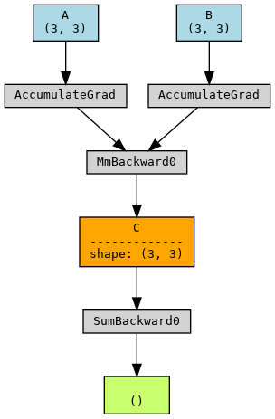

PyTorchViz
=======

A small package to create visualizations of PyTorch execution graphs and traces.

[](https://colab.research.google.com/github/szagoruyko/pytorchviz/blob/master/examples.ipynb)

## Installation

Install graphviz, e.g.:

```
brew install graphviz
```

Install the package itself:

```
pip install torchviz
```

### Install this fork

```
pip install git+https://github.com/rislab/pytorchviz.git
```

Or if you plan on making changes locally.
```
git clone git@github.com:rislab/pytorchviz.git
cd pytorchviz
pip install -e .
```

## Usage
Example usage of `make_dot`:
```
model = nn.Sequential()
model.add_module('W0', nn.Linear(8, 16))
model.add_module('tanh', nn.Tanh())
model.add_module('W1', nn.Linear(16, 1))

x = torch.randn(1, 8)
y = model(x)

make_dot(y.mean(), params=dict(model.named_parameters()))
```


### Labeling a tensor
Example usage of labelling a tensor with `label_var(tensor, "label")`.

See `test/test_labels.py::test_label_var`.

```python
import torch
import torchviz as tv

A = torch.randn(3, 3, requires_grad=True)
B = torch.randn(3, 3, requires_grad=True)
C = A @ B
# label a tensor
C = tv.label_var(C, "C")
loss = C.sum()

dot = tv.make_dot(loss, params={"A": A, "B": B})
dot.view()
```




### Labeling an arg
Example of labelling an arg.

See `test/test_labels.py::test_label_args`.

```python
import torch
import torchviz as tv

A = torch.randn(3, 3, requires_grad=True)
B = torch.randn(3, 3, requires_grad=True)
# label the args
A = tv.label_arg(A, "A")
B = tv.label_arg(B, "B")
C = A @ B
# label a tensor
C = tv.label_var(C, "C")
loss = C.sum()

dot = tv.make_dot(loss, params={"A": A, "B": B})
dot.view()
```


### Labeling a return value
Example of labelling an return value. When both the args and return values are
labelled, a subgraph for that function will automatically be created.

See `test/test_labels.py::test_label_args_rets`.

```python
import torch
import torchviz as tv

A = torch.randn(3, 3, requires_grad=True)
B = torch.randn(3, 3, requires_grad=True)
# label the args
A = tv.label_arg(A, "A")
B = tv.label_arg(B, "B")
C = A @ B
# label return value
C = tv.label_ret(C, "C")
loss = C.sum()

dot = tv.make_dot(loss, params={"A": A, "B": B})
dot.view()
```


### Labeling a function
Example of labelling a function. When the function takes in tensor args and kwargs
and returns a tensor or tuple of tensors, we can use a decorator `label_fn` to
do the labelling for us. It will call `label_arg` and `label_ret` under the 
hood and track which function it belongs to (as well as how many times the 
function was called), so we get a separate groups for calls to the same function.
All you have to do is label the return values `label_fn("ret 1", "ret 2",...)`.

See `test/test_labels.py::test_label_fn`.

```python
import torch
import torchviz as tv

@tv.label_fn("A", "C")
def foo(A, B):
    C = A @ B
    return C, A

@tv.label_fn()
def bar(X, Y):
    Z, X = foo(X, Y)
    X, _ = foo(X, Y)
    W = X * Z
    return W

A = torch.randn(3, 3, requires_grad=True)
B = torch.randn(3, 3, requires_grad=True)
C = bar(A, B)
loss = C.sum()

dot = tv.make_dot(loss, params={"A": A, "B": B})
dot.render('test/test_label_fn', format='png', view=True, cleanup=True)
```


## Acknowledgements

The script was moved from [functional-zoo](https://github.com/szagoruyko/functional-zoo) where it was created with the help of Adam Paszke, Soumith Chintala, Anton Osokin, and uses bits from [tensorboard-pytorch](https://github.com/lanpa/tensorboard-pytorch).
Other contributors are [@willprice](https://github.com/willprice), [@soulitzer](https://github.com/soulitzer), [@albanD](https://github.com/albanD).
